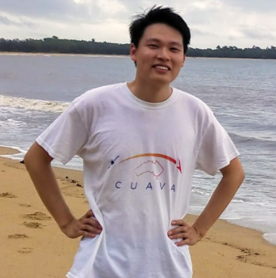

# The OpenHSI Team

OpenHSI is an initiative to make hyperspectral technology more accessible to remote sensing practitioners through an open-source design and software. The collaboration consists of the following people:

### Dr. Bradley Evans | Team Leader (Affiliate, The University of Sydney)

<table>
<tr>
<td style="width:20%" valign="top"></td>
<td valign="top">
Brad’s research is focused on the use of Earth Observation, using spectral cameras, UAV’s, Aircraft, CubeSats and Satellites to enhance our understanding of the Carbon and Water cycle. In a practical sense, this involves mapping and modelling plant growth, crop yield and other plant related activities remotely. This research is achieved through using the state-of-the-art in sensors, Hyperspectral Imaging Spectrometers, Thermal imagers and a range of Multispectral and Spectroscopy based approaches.

Brad has been a Director of the Terrestrial Ecosystem Research Network Ecosystem Modelling and Scaling Infrastructure, and Director of Sydney Informatics Hub.

In recent years, Brad has worked on novel ways of mapping plant growth (E.g. NASA’s OCO2 based Solar Induced Fluorescence based model: https://sydney.edu.au/news-opinion/news/2017/10/13/new-technique-tracks-plant-photosynthesis-from-space.html) and innovative ways to improve existing approaches (Nature Plants: https://www.nature.com/articles/s41477-017-0006-8 ).
</td> 
</tr>
</table>

### Dr. Christopher Betters | Hardware Lead (Research Fellow, The University of Sydney)
<table>
<tr>
<td style="width:20%" valign="top"></td>
<td valign="top">
Chris's research focuses on the development (design, construction, characterisation, and implementation) of cutting-edge compact optical instruments that harness the latest photonic technologies, originally for astronomical applications. More recently, he has been using techniques and methods developed for astronomy to tackle a broader range of problems in academia and industry, specifically in remote earth observation and agriculture.
</td> 
</tr>
</table>

### Yiwei Mao | Software Lead (PhD Researcher, The University of Sydney
<table>
<tr>
<td style="width:20%" valign="top"></td>
<td valign="top">
Yiwei is the core developer of the OpenHSI software stack and has interests in computer vision and machine learning. He has in the past interned at CSIRO Astronomy and Space Science, and Imagination Technologies.
</td> 
</tr>
</table>

### Samuel Garske (PhD Researcher, The University of Sydney)
<table>
<tr>
<!-- <td style="width:20%" valign="top"></td> -->
<td valign="top">
Sam, is another key member of the OpenHSI software stack working, and developing on efficient and fast georectification methods.
</td> 
</tr>
</table>

### Dr Terry Cocks | Hyvista Corporation
<table>
<tr>
<td style="width:20%" valign="top"></td>
<td valign="top">

Dr Terry Cocks graduated from the University of Adelaide and firstly joined the CSIRO Division of Cloud Physics to develop techniques for the remote sensing of cloud properties.  He then joined the CSIRO Division of Mineral Physics to develop airborne instrumentation for the remote sensing of the earth’s surface for applications in geological mapping and mineral exploration. 

In 1989, he left CSIRO to start Integrated Spectronics (now IntSpec Systems), a company to develop and market spectral sensing instruments.  The company released the first hand held SWIR spectrometer for in-field mineral analysis (PIMA) and later the HyMap series of airborne hyperspectal scanners.  The company also developed a field spectrometer for horticultural applications and a prototype imaging spectrometer suitable for deployment on UAV’s 

In 1998, he founded HyVista Corporation to undertake contract airborne hyperspectral surveys and deliver processed maps to clients.  HyVista Corporation went on to become a significant supplier of imagery and maps to a world-wide range of government agencies, research institutions and commercial organisations such as mining companies. 

http://www.hyvista.com/

</td> 
</tr>
</table>

### A/Prof. Sergio Leon-Saval (Director SAIL, The University of Sydney)
<table>
<tr>
<td style="width:20%" valign="top"></td>
<td valign="top">

Sergio Leon-Saval is an Associate Professor at the School of Physics in the University of Sydney. He was awarded his PhD by the University of Bath, UK, in 2006. In 2007, he joined the University of Sydney where he is now Director of the Sydney Astrophotonics Instrumentation Laboratory (SAIL), and Deputy Director of the Institute of Photonics and Optical Science (IPOS). A/Prof Leon-Saval has more than 16 years of experience in the research area of photonics. 

He has made breakthrough contributions in the field of specialty optical fibres, astrophotonics and optical instrumentation systems. He has published over 75 international refereed journals and more than 180 conference papers since 2004 with over 6700 citations, and a h-index of 41. A/Prof Leon-Saval has been a member of technical program and management committees on more than 10 international conferences. 

He is a Senior Member of the Optical Society of America (OSA), and member of the Australian and New Zealand Optical Society (ANZOS). He was the 2019 recipient of the ANZOS John Love Award, that recognizes innovations and technical advances in the field of optics.
</td> 
</tr>
</table>

### Professor Iver Cairns (Director CUAVA, The University of Sydney)
<table>
<tr>
<td style="width:20%" valign="top"></td>
<td valign="top">
Iver Cairns has over 30 years of experience in space physics and space weather research. His primary expertise is in the theory, simulation, and analysis of plasma waves and radio emissions. Iver has over 300 published, refereed, papers in journals and books. He is a Co-Investigator on NASA’s STEREO mission and, since June 2019, on NASA’s two new SMEX missions, PUNCH and TRACERS. Prof. Cairns has held multiple leadership positions in Australian and international scientific societies, including the Asia Oceania Geosciences Society (AOGS), the Committee on Space Research (COSPAR), International Association for Geomagnetism and Aeronomy (IAGA), and the Solar Terrestrial and Space Physics (STSP) Group of the Australian Institute of Physics.  Currently he is Chair of COSPAR’s Finance Committee and of the Program Committee for the 2020 COSPAR Assembly in Sydney, as well as the longtime Co-Chair of the Australian Space Research Conference. Within Australia Iver led the 2010-2019 Decadal Plan for Australian Space Science and chaired the Academy of Science’s National Committee for Space Science 2004 – 2011. Since then he has worked to convince Governments to invest in the space sector. He led the INSPIRE-2 CubeSat project, which launched in May 2017 and re-entered still working in November 2018. Currently Iver leads CUAVA, the ARC Training Centre for CubeSats, UAVs, and Their Applications, which is training people, solving research problems, and working on commercial outcomes for its industry, academic, and governmental partners.

A longer bio is available at [https://www.sydney.edu.au/science/about/our-people/academic-staff/iver-cairns.html].

</td> 
</tr>
</table>

### Timothy Snailham, PhD Researcher – The University of Sydney
<table>
<tr>
<!-- <td style="width:20%" valign="top"></td> -->
<td valign="top">
Tim is working on future verisons of the OpenHSI hardware and optical design for UAVs and spacecraft.
</td> 
</tr>
</table>

