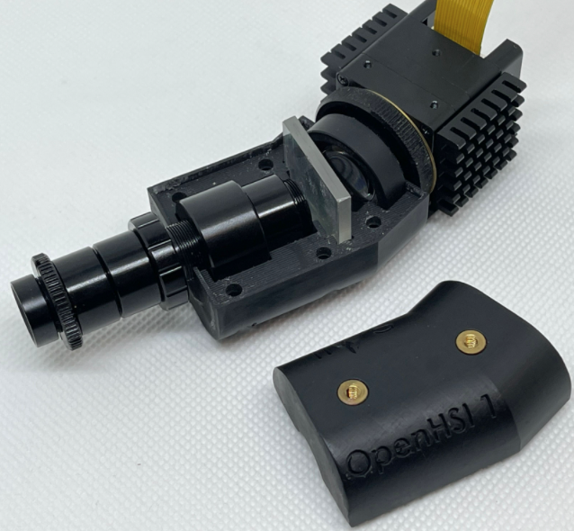

<div style="text-align: right"> <a href="./about.html">ABOUT US</a> </div>

Hello, and welcome to the homepage for the OpenHSI project!

## The OpenHSI Project

OpenHSI is an open-source initiative to increase the accessibility of hyperspectral technology. It consists of a lightweight pushbroom imaging spectrometer using commercial-off-the-shelf components and supporting software to calibrate, capture, and process hyperspectral datacubes on development compute platforms. The project was developed by staff and students at the University of Sydney. 

The software library `openhsi` provides Remote Sensing practitioners the ability to produce reflectance data using open-source tools such as NASA’s 6S radiative transfer model through the Py6S Python wrapper, as well as empirical line calibration. There are also tools to interactively explore datasets and edit metadata. 

The University of Sydney’s Associate Professor Sergio Leon-Saval and Dr Christopher Betters of the Sydney Astrophotonic Instrumentation Laboratory (SAIL) developed the first OpenHSI camera from previously published designs, adapting it to readily available materials, and thus incrementally changing the design.

The Australian Research Council funded training centre CubeSats, UAV and their applications (CUAVA) students [Yiwei Mao](https://yiweimao.github.io/blog/) (PhD Candidate) and Samuel Garske (PhD candidate) developed their software to support the camera as part of their PhD and have publications pending on their work. Professors Iver Cairns and Associate Professor K.C.Wong and Dr Bradley Evans supervise Yiwei and Sam.

<!-- Robonation, co-organisers of the [RobotX 2022](https://www.dst.defence.gov.au/event/2022-maritime-robotx-challenge) Event in Sydney, together with DSTG and funded by the Next Generation Technologies Fund, will use a version of the OpenHSI system in the Australian based event.  -->

Since the project commenced, Sydney Photonics Pty Ltd, an Australian Company was founded by Dr Christopher Betters to commercialise the technology, and is supplying competitors in the RobotX 2022 competition with OpenHSI cameras developed for Robonation.

Join us in making use of this technology, help us enhance the communities understanding of hyperspectral imaging spectroscopy. We encourage you to participate in the community and support the work of the OpenHSI team.



# Publication




```
@article{mao2022openhsi,
  title={OpenHSI: A complete open-source hyperspectral imaging solution for everyone},
  author={Mao, Yiwei, et al.},
  journal={in-prep},
  volume={},
  number={},
  pages={},
  year={2022}
}
```

## Python Library

We have a Python library `openhsi` to support the OpenHSI camera.

### Documentation and Tutorials

Check out our software documentation and examples on how to use each module. 

[https://openhsi.github.io/openhsi/](https://openhsi.github.io/openhsi/)

Also, we have a [Quick Start Guide](https://openhsi.github.io/openhsi/tutorial_camera.html).

### Github Repo/Source

The source was entirely developed in Jupyter logbooks. Check out how we did it here:

[https://github.com/openhsi/openhsi/](https://github.com/openhsi/openhsi/)


### PyPi 

Install using `pip`:
[https://pypi.org/project/openhsi/](https://pypi.org/project/openhsi/)

### Conda/Anaconda 

Install using `conda`:
[https://anaconda.org/openhsi/openhsi](https://anaconda.org/openhsi/openhsi)

[](https://anaconda.org/openhsi/openhsi)


